# 🚀 Ubuntu Migration & Installation Guide
(LVM + External Backup)
---
## <b>Author: @coolsheets</b>

Date: March 8, 2025
---

## 📌 Overview
This guide details the **fresh installation of Ubuntu on a new SSD (using LVM)** and the **migration of settings, applications, and personal files from an external backup**.

---

## 📌 Step 1: Install Ubuntu with LVM on New SSD

### 1️⃣ **Boot Ubuntu Live USB**
1. **Create a bootable USB**:
   ```bash
   sudo apt install mkusb
   mkusb Ubuntu-24.04.iso
   ```
2. **Reboot** and enter BIOS (`F2` or `F12`).
3. **Select "Try Ubuntu"** (DO NOT install yet).

### 2️⃣ **Setup LVM During Installation**
1. **Launch Installer** → Click **Install Ubuntu**.
2. Choose **Erase disk and install Ubuntu**.
3. Select **Use LVM** → **Next**.
4. Choose **Disk Layout**:
   - `/` (Root) → **100-150 GiB** (LVM)
   - `/home` → **Remaining space** (LVM)
   - **Swap file** (Automatic)
5. Click **Install Now** → Complete the setup.

### 3️⃣ **Update & Install Essentials**
```bash
sudo apt update && sudo apt upgrade -y
sudo apt install git curl build-essential -y
```

---

## 📌 Step 2: Set Up KVM for Windows VM

### 1️⃣ **Install KVM & Virtual Machine Manager (GUI)**
```bash
sudo apt install qemu-kvm libvirt-daemon-system virt-manager -y
sudo usermod -aG libvirt $(whoami)
reboot
```

### 2️⃣ **Verify KVM Installation**
```bash
kvm-ok
```
Expected output:
```
INFO: /dev/kvm exists
KVM acceleration can be used
```

### 3️⃣ **Configure Windows External Boot in KVM**
1. **Identify Windows disk**:
   ```bash
   lsblk
   ```
2. **Attach to KVM**:
   - Open **Virtual Machine Manager (`virt-manager`)**.
   - Click **New VM** → **Custom**.
   - Select **Physical Disk** (`/dev/nvme1n1`).
   - Assign CPU & RAM (`8GB RAM, 4 CPU cores recommended`).
   - Finish setup.

---

## 📌 Step 3: Migrate Ubuntu Settings & Applications

### 1️⃣ **Backup System Information from Old Ubuntu**
Run these commands **before wiping the old system**:
```bash
dpkg --get-selections > installed_packages.txt
dconf dump / > dconf-settings-backup.ini
gsettings list-recursively > gnome-settings.txt
```

### 2️⃣ **Restore Applications & Settings**
On the **new Ubuntu installation**, copy the backup files and run:
```bash
sudo dpkg --set-selections < installed_packages.txt
sudo apt-get dselect-upgrade -y
dconf load / < dconf-settings-backup.ini
```

### 3️⃣ **Restore Home Directory**
```bash
rsync -aAXv /backup_location/ ~
```

---

## 📌 📊 Installation & Migration Flowchart

```mermaid
graph TD
    A[Start: Install New SSD] --> B[Boot Ubuntu Live USB]
    B --> C[Select 'Install Ubuntu']
    C --> D{Use LVM?}
    D -->|Yes| E[Partition with LVM]
    E --> F[Install Ubuntu]
    F --> G[Update System & Install KVM]
    G --> H{Use Windows?}
    H -->|Yes| I[Boot Windows from External SSD]
    I --> J{Windows Boot Successful?}
    J -->|Yes| K[Use External SSD for Windows]
    J -->|No| L[Install Windows in KVM]
    L --> M[Windows VM Ready]
    K & M --> N[Restore Ubuntu Settings & Apps]
    N --> O[Sync Home Directory]
    O --> P[Final System Ready 🎉]
```


---

## 📌 🎯 Final Steps
✔ **Ubuntu Installed with LVM**  
✔ **KVM Set Up & Running**  
✔ **Windows Boot from External SSD Verified**  
✔ **Ubuntu Migration Completed**  

If anything goes wrong, refer back to this guide for troubleshooting. Happy computing! 🚀

